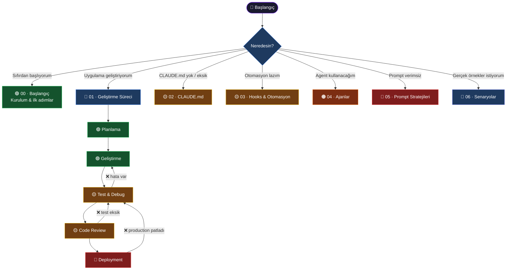

# Claude Code Rehberi

[![Built for Claude Code](https://img.shields.io/badge/Claude%20Code%20için-DA7756?style=for-the-badge&logo=data:image/svg%2bxml;base64,PHN2ZyB4bWxucz0iaHR0cDovL3d3dy53My5vcmcvMjAwMC9zdmciIHZpZXdCb3g9IjAgMCAxMDAgMTAwIj48ZyB0cmFuc2Zvcm09InRyYW5zbGF0ZSg1MCw1MCkiIGZpbGw9IiNmZmYiPjxyZWN0IHg9Ii00IiB5PSItMzAiIHdpZHRoPSI4IiBoZWlnaHQ9IjI4IiByeD0iNCIvPjxyZWN0IHg9Ii00IiB5PSItMzAiIHdpZHRoPSI4IiBoZWlnaHQ9IjI4IiByeD0iNCIgdHJhbnNmb3JtPSJyb3RhdGUoNDUpIi8+PHJlY3QgeD0iLTQiIHk9Ii0zMCIgd2lkdGg9IjgiIGhlaWdodD0iMjgiIHJ4PSI0IiB0cmFuc2Zvcm09InJvdGF0ZSg5MCkiLz48cmVjdCB4PSItNCIgeT0iLTMwIiB3aWR0aD0iOCIgaGVpZ2h0PSIyOCIgcng9IjQiIHRyYW5zZm9ybT0icm90YXRlKDEzNSkiLz48cmVjdCB4PSItNCIgeT0iLTMwIiB3aWR0aD0iOCIgaGVpZ2h0PSIyOCIgcng9IjQiIHRyYW5zZm9ybT0icm90YXRlKDE4MCkiLz48cmVjdCB4PSItNCIgeT0iLTMwIiB3aWR0aD0iOCIgaGVpZ2h0PSIyOCIgcng9IjQiIHRyYW5zZm9ybT0icm90YXRlKDIyNSkiLz48cmVjdCB4PSItNCIgeT0iLTMwIiB3aWR0aD0iOCIgaGVpZ2h0PSIyOCIgcng9IjQiIHRyYW5zZm9ybT0icm90YXRlKDI3MCkiLz48cmVjdCB4PSItNCIgeT0iLTMwIiB3aWR0aD0iOCIgaGVpZ2h0PSIyOCIgcng9IjQiIHRyYW5zZm9ybT0icm90YXRlKDMxNSkiLz48L2c+PC9zdmc+&logoColor=white)](https://claude.ai/code)

**Her seviyeden software developer için uygulama geliştirme sürecinin her aşamasında Claude Code rehberi**

---

Aşağıdaki diyagramda **şu an bulunduğun noktayı** seç ve ilgili bölüme geç. Yanlış bir adım attıysan her sayfanın altındaki **↩ Bir Şeyler Ters Gittiyse** tablosu seni doğru noktaya geri getirir.

---

## Navigasyon

> Renk skalası: 🟢 Kolay başlangıç — 🟡 Orta — 🟠 İleri — 🔴 Dikkat gerektiren  
> Kırmızı oklar (`❌`) hata durumunda geri dönüş yolunu gösterir.

---

## Bölümler

| # | Bölüm | Ne öğrenirsin |
|---|---|---|
| ⚡ | [Hızlı Başvuru Kartı](./cheatsheet.md) | Tüm komutlar, kısayollar, şablonlar ve hook tarifleri tek sayfada |
| 00 | [Başlangıç](./00-baslangic/README.md) | Claude Code nedir, kurulum, bu repoyu nasıl takip etmelisin |
| 01 | [Geliştirme Süreci](./01-gelistirme-sureci/README.md) | Planlama → Geliştirme → Test → Review → Deployment |
| 02 | [CLAUDE.md](./02-claude-md/README.md) | Proje bağlamı kurma, şablonlar, import ve memory |
| 03 | [Hooks & Otomasyon](./03-hooks-otomasyon/README.md) | settings.json, hook tipleri, hazır tarifler |
| 04 | [Ajanlar](./04-ajanlar/README.md) | Agent tool, subagent tipleri, paralel çalıştırma |
| 05 | [Prompt Stratejileri](./05-prompt-stratejileri/README.md) | Plan modu, bağlam yönetimi, yaygın hatalar, ileri düzey |
| 06 | [Gerçek Senaryolar](./06-senaryolar/README.md) | Sıfırdan SaaS, legacy modernizasyon, production krizi, yeni özellik ekleme |

---

## Hızlı Geri Dönüş Haritası

| Durum | Geri Dön |
|---|---|
| Claude projeyi anlamamış gibi davranıyor | [CLAUDE.md Temel Yapı](./02-claude-md/01-temel-yapi.md) |
| Hook hiç tetiklenmiyor | [settings.json Konumu](./03-hooks-otomasyon/01-settings-json.md#konum-ve-format) |
| Ajan beklenen sonucu döndürmüyor | [Agent Tool — Temel Kullanım](./04-ajanlar/01-agent-tool.md) |
| Claude çok fazla / az kod yazıyor | [Yaygın Hatalar](./05-prompt-stratejileri/03-yaygin-hatalar.md) |
| Deploy adımında CI/CD bozuldu | [Deployment Kontrol Listesi](./01-gelistirme-sureci/05-deployment.md#kontrol-listesi) |
| Context doldu, konuşma kayboldu | [Bağlam Yönetimi](./05-prompt-stratejileri/02-baglam-yonetimi.md) |
| Test geçiyor ama production patlıyor | [Test & Debug](./01-gelistirme-sureci/03-test-ve-debug.md) |

---

## Katkı

Bu repo topluluk katkısına açıktır.

- Hata veya eksik bildi → [Issue aç](https://github.com/ismailcelik-tr/claude-code-guide/issues/new)
- İçerik katkısı → [CONTRIBUTING.md](./CONTRIBUTING.md)
- Güvenlik bildirimi → [SECURITY.md](./SECURITY.md)
- Lisans → [MIT](./LICENSE)
