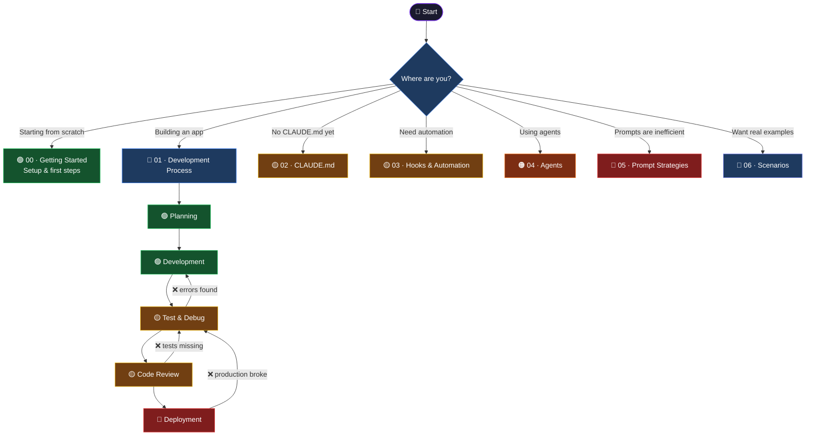

# Claude Code Guide

[![Built for Claude Code](https://img.shields.io/badge/Claude%20Code-DA7756?style=for-the-badge&logo=data:image/svg%2bxml;base64,PHN2ZyB4bWxucz0iaHR0cDovL3d3dy53My5vcmcvMjAwMC9zdmciIHZpZXdCb3g9IjAgMCAxMDAgMTAwIj48ZyB0cmFuc2Zvcm09InRyYW5zbGF0ZSg1MCw1MCkiIGZpbGw9IiNmZmYiPjxyZWN0IHg9Ii00IiB5PSItMzAiIHdpZHRoPSI4IiBoZWlnaHQ9IjI4IiByeD0iNCIvPjxyZWN0IHg9Ii00IiB5PSItMzAiIHdpZHRoPSI4IiBoZWlnaHQ9IjI4IiByeD0iNCIgdHJhbnNmb3JtPSJyb3RhdGUoNDUpIi8+PHJlY3QgeD0iLTQiIHk9Ii0zMCIgd2lkdGg9IjgiIGhlaWdodD0iMjgiIHJ4PSI0IiB0cmFuc2Zvcm09InJvdGF0ZSg5MCkiLz48cmVjdCB4PSItNCIgeT0iLTMwIiB3aWR0aD0iOCIgaGVpZ2h0PSIyOCIgcng9IjQiIHRyYW5zZm9ybT0icm90YXRlKDEzNSkiLz48cmVjdCB4PSItNCIgeT0iLTMwIiB3aWR0aD0iOCIgaGVpZ2h0PSIyOCIgcng9IjQiIHRyYW5zZm9ybT0icm90YXRlKDE4MCkiLz48cmVjdCB4PSItNCIgeT0iLTMwIiB3aWR0aD0iOCIgaGVpZ2h0PSIyOCIgcng9IjQiIHRyYW5zZm9ybT0icm90YXRlKDIyNSkiLz48cmVjdCB4PSItNCIgeT0iLTMwIiB3aWR0aD0iOCIgaGVpZ2h0PSIyOCIgcng9IjQiIHRyYW5zZm9ybT0icm90YXRlKDI3MCkiLz48cmVjdCB4PSItNCIgeT0iLTMwIiB3aWR0aD0iOCIgaGVpZ2h0PSIyOCIgcng9IjQiIHRyYW5zZm9ybT0icm90YXRlKDMxNSkiLz48L2c+PC9zdmc+&logoColor=white)](https://claude.ai/code)

**A guide for software developers to use Claude Code effectively at every stage of the development process**

---

Select your current position in the diagram below and navigate to the relevant section. If you take a wrong step, the **↩ Something Went Wrong** table at the bottom of each page will guide you back.

---

## Navigation

> Color scale: 🟢 Easy/Beginner — 🟡 Intermediate — 🟠 Advanced — 🔴 Requires attention  
> Red arrows (`❌`) indicate fallback paths on failure.

---

## Sections

| # | Section | What you'll learn |
|---|---|---|
| ⚡ | [Cheat Sheet](./cheatsheet.md) | All commands, shortcuts, templates and hook recipes on one page |
| 00 | [Getting Started](./00-getting-started/README.md) | What is Claude Code, setup, how to follow this guide |
| 01 | [Development Process](./01-development-process/README.md) | Planning → Development → Test → Review → Deployment |
| 02 | [CLAUDE.md](./02-claude-md/README.md) | Setting up project context, templates, import and memory |
| 03 | [Hooks & Automation](./03-hooks-automation/README.md) | settings.json, hook types, ready-to-use recipes |
| 04 | [Agents](./04-agents/README.md) | Agent tool, subagent types, parallel execution |
| 05 | [Prompt Strategies](./05-prompt-strategies/README.md) | Plan mode, context management, common mistakes, advanced |
| 06 | [Real Scenarios](./06-scenarios/README.md) | SaaS from scratch, legacy modernization, production crisis, and more |

---

## Quick Recovery Map

| Situation | Go back to |
|---|---|
| Claude doesn't seem to understand the project | [CLAUDE.md Basic Structure](./02-claude-md/01-basic-structure.md) |
| Hook never triggers | [settings.json Location](./03-hooks-automation/01-settings-json.md#location-and-format) |
| Agent returns unexpected result | [Agent Tool — Basic Usage](./04-agents/01-agent-tool.md) |
| Claude writes too much / too little code | [Common Mistakes](./05-prompt-strategies/03-common-mistakes.md) |
| CI/CD broke at deploy step | [Deployment Checklist](./01-development-process/05-deployment.md#checklist) |
| Context filled up, conversation lost | [Context Management](./05-prompt-strategies/02-context-management.md) |
| Tests pass but production breaks | [Test & Debug](./01-development-process/03-test-and-debug.md) |

---

## Contributing

This repo is open to community contributions.

- Report errors or missing content → [Open an issue](https://github.com/ismailcelik-tr/claude-code-guide/issues/new)
- Content contributions → [CONTRIBUTING.md](./CONTRIBUTING.md)
- Security reports → [SECURITY.md](./SECURITY.md)
- License → [MIT](./LICENSE)
