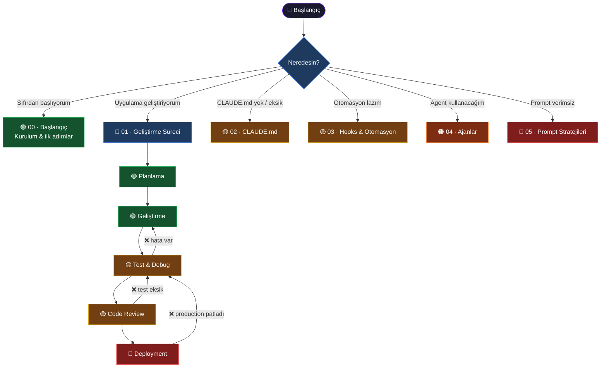

# Claude Code Rehberi

> **Hedef kitle:** Her seviyeden software developer  
> **Amaç:** Uygulama geliştirme sürecinin her aşamasında Claude Code'u en efektif şekilde kullanmak

Aşağıdaki diyagramda **şu an bulunduğun noktayı** seç ve ilgili bölüme geç. Yanlış bir adım attıysan her sayfanın altındaki **↩ Bir Şeyler Ters Gittiyse** tablosu seni doğru noktaya geri getirir.

---

## Navigasyon

> Renk skalası: 🟢 Kolay başlangıç — 🟡 Orta — 🟠 İleri — 🔴 Dikkat gerektiren  
> Kırmızı oklar (`❌`) hata durumunda geri dönüş yolunu gösterir.

---

## Bölümler

| # | Bölüm | Ne öğrenirsin |
|---|---|---|
| 00 | [Başlangıç](./00-baslangic/README.md) | Claude Code nedir, kurulum, bu repoyu nasıl takip etmelisin |
| 01 | [Geliştirme Süreci](./01-gelistirme-sureci/README.md) | Planlama → Geliştirme → Test → Review → Deployment |
| 02 | [CLAUDE.md](./02-claude-md/README.md) | Proje bağlamı kurma, şablonlar, import ve memory |
| 03 | [Hooks & Otomasyon](./03-hooks-otomasyon/README.md) | settings.json, hook tipleri, hazır tarifler |
| 04 | [Ajanlar](./04-ajanlar/README.md) | Agent tool, subagent tipleri, paralel çalıştırma |
| 05 | [Prompt Stratejileri](./05-prompt-stratejileri/README.md) | Plan modu, bağlam yönetimi, yaygın hatalar, ileri düzey |

---

## Hızlı Geri Dönüş Haritası

| Durum | Geri Dön |
|---|---|
| Claude projeyi anlamamış gibi davranıyor | [CLAUDE.md Temel Yapı](./02-claude-md/01-temel-yapi.md) |
| Hook hiç tetiklenmiyor | [settings.json Konumu](./03-hooks-otomasyon/01-settings-json.md#konum-ve-format) |
| Ajan beklenen sonucu döndürmüyor | [Agent Tool — Temel Kullanım](./04-ajanlar/01-agent-tool.md) |
| Claude çok fazla / az kod yazıyor | [Yaygın Hatalar](./05-prompt-stratejileri/03-yaygin-hatalar.md) |
| Deploy adımında CI/CD bozuldu | [Deployment Kontrol Listesi](./01-gelistirme-sureci/05-deployment.md#kontrol-listesi) |
| Context doldu, konuşma kayboldu | [Bağlam Yönetimi](./05-prompt-stratejileri/02-baglam-yonetimi.md) |
| Test geçiyor ama production patlıyor | [Test & Debug](./01-gelistirme-sureci/03-test-ve-debug.md) |

---

## Katkı

Bu repo topluluk katkısına açıktır. Her sayfanın altında eksik veya hatalı bir bilgi görürsen PR aç.
